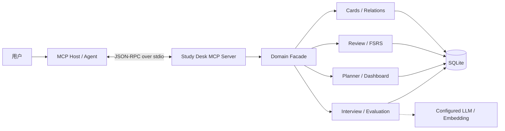
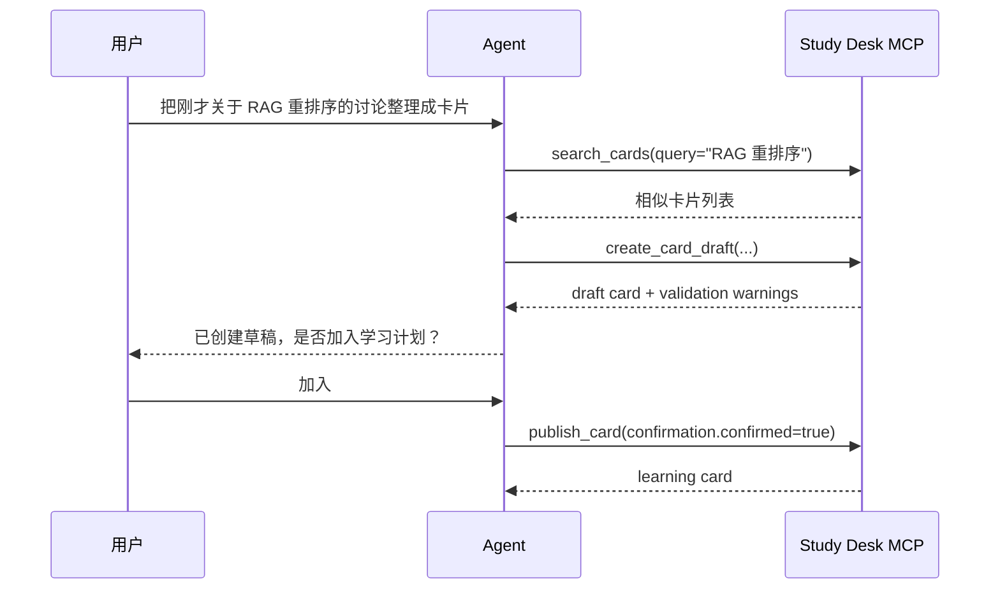

# Study Desk Agent MCP 设计

## 1. 目标

为 Codex、Claude Desktop 等 MCP Host 提供一个本地 MCP Server，让 Agent 能读取 Study Desk 的学习上下文、辅助整理卡片、发起练习并提交结果，同时不绕过现有校验、FSRS 排程和数据安全边界。

首版只服务当前本机用户，采用 `stdio` transport。远程、多用户和 OAuth 不进入 MVP。

## 2. 设计原则

1. **领域函数是唯一事实来源**：MCP handler 调用 `src/lib` 中的业务函数，不直接拼 SQL，也不通过本机 HTTP 绕行 Next.js route。
2. **读写分级**：查询工具可直接调用；创建和修改默认写入草稿；影响排程或删除数据的动作必须显式确认。
3. **一次调用只做一件事**：工具保持小而稳定，复杂工作流由 Agent 编排。
4. **返回机器可读结果**：所有工具都提供 `structuredContent`，文本内容只用于给人类快速阅读。
5. **不把模型放进 MCP Server**：Server 暴露 Study Desk 能力；推理和工具选择由 MCP Host 中的 Agent 完成。仅答案评估复用应用现有的 AI/Embedding 能力。

## 3. 架构



建议新增独立入口 `src/mcp/index.ts`，同时抽出 `src/mcp/domain.ts` 作为适配层。Next.js API routes 与 MCP handlers 共同调用相同的 `src/lib` 领域函数。

## 4. MCP 能力

### 4.1 Resources

Resources 适合由 Host 按需加入上下文，不产生副作用。

| URI | 内容 |
| --- | --- |
| `study-desk://dashboard/today` | 今日任务、到期复习数、今日完成数 |
| `study-desk://cards/{cardId}` | 单张卡片、关联卡片、学习摘要 |
| `study-desk://review/queue` | 当前复习进度和下一批候选 |
| `study-desk://settings/capabilities` | 是否配置 LLM、支持的比较模式；不返回密钥 |

Resource 内容应支持 JSON，并设置稳定的 MIME 类型 `application/json`。卡片列表不做成 resource；列表需要筛选和分页，更适合作为 tool。

### 4.2 Tools

#### 读取类（无确认）

| Tool | 关键输入 | 结果 |
| --- | --- | --- |
| `search_cards` | `query?`, `track?`, `tags?`, `status?`, `limit?`, `cursor?` | 精简卡片、学习摘要、下一页 cursor |
| `get_card` | `cardId` | 完整卡片、关系和学习详情 |
| `get_today_plan` | 无 | 今日任务与统计 |
| `get_review_queue` | `limit?`, `focus?` | 待学/待复习卡片，不修改队列 |
| `get_interview_report` | `sessionId` | 面试逐题结果和总分 |

#### 低风险写入（直接执行）

| Tool | 关键输入 | 结果 |
| --- | --- | --- |
| `create_card_draft` | `question`, `answerPoints`, `track`, `tags?`, `relations?`, `source?` | `status=draft` 的卡片 |
| `update_card_draft` | `cardId`, `patch`, `expectedUpdatedAt` | 更新后的草稿；乐观锁冲突时拒绝 |
| `archive_card` | `cardId`, `expectedUpdatedAt` | 归档后的卡片（可恢复） |

`create_card_draft` 必须默认写入 `draft`，不能由 Agent 在同一调用里改成 `learning` 或 `review`。

#### 学习状态写入（需要明确用户意图）

| Tool | 关键输入 | 结果 |
| --- | --- | --- |
| `publish_card` | `cardId`, `expectedUpdatedAt`, `confirmation` | 将草稿加入学习队列 |
| `evaluate_answer` | `cardId`, `presentedQuestion`, `answer`, `comparisonMode?` | 只评估，不写 review log |
| `submit_review` | `cardId`, `presentedQuestion`, `answer`, `rating`, `comparisonMode?`, `idempotencyKey`, `confirmation` | 评估结果、新到期时间、review log id |
| `start_interview` | `mode?`, `scope?`, `confirmation` | session 与首题 |
| `answer_interview_turn` | `sessionId`, `turnId`, `answer`, `comparisonMode?`, `idempotencyKey` | 本题反馈与下一题 |

`confirmation` 使用固定结构，不接受任意文本：

```json
{
  "confirmed": true,
  "summary": "提交本次复习，并按 good 更新 FSRS 排程"
}
```

Host 仍负责向用户展示批准 UI；该字段用于防止 Agent 在未表达写入意图时误调用。

#### 不在 MVP 暴露

- 永久删除卡片。
- 导入/覆盖备份。
- 修改 LLM API Key、Base URL 或模型设置。
- 任意 SQL、任意文件读写。
- 代表用户自动确认记忆评级。

## 5. 关键 Schema

### `search_cards`

```ts
const SearchCardsInput = z.object({
  query: z.string().max(200).optional(),
  track: z.string().max(80).optional(),
  tags: z.array(z.string().max(80)).max(20).optional(),
  status: z.enum(["draft", "learning", "review", "archived"]).optional(),
  limit: z.number().int().min(1).max(50).default(20),
  cursor: z.string().optional(),
});
```

Cursor 应编码稳定排序键，例如 `updatedAt + id`，不能使用 offset 作为长期游标。

### `create_card_draft`

```ts
const CreateCardDraftInput = z.object({
  question: z.string().trim().min(3).max(500),
  answerPoints: z.array(z.object({
    content: z.string().trim().min(1).max(2_000),
    hint: z.string().max(500).default(""),
    note: z.string().max(2_000).default(""),
    role: z.enum(["opening", "key", "closing"]).default("key"),
    parentId: z.string().uuid().optional(),
  })).min(1).max(50),
  track: z.string().trim().min(1).max(80),
  tags: z.array(z.string().max(80)).max(20).default([]),
  relations: z.array(z.object({
    cardId: z.string().uuid(),
    type: z.enum(["related", "parent", "child"]),
  })).max(30).default([]),
  source: z.string().max(500).optional(),
});
```

Server 为 answer point 生成 UUID，并继续使用现有的层级、重复问法、标签和关联卡片校验。

### 统一成功结果

```json
{
  "ok": true,
  "data": {},
  "meta": {
    "requestId": "uuid",
    "serverVersion": "1.0.0"
  }
}
```

### 统一业务错误

```json
{
  "ok": false,
  "error": {
    "code": "STALE_WRITE",
    "message": "卡片已被其他操作更新，请重新读取后再修改。",
    "retryable": true,
    "details": {}
  },
  "meta": { "requestId": "uuid" }
}
```

建议稳定错误码：`NOT_FOUND`、`VALIDATION_ERROR`、`CONFLICT`、`STALE_WRITE`、`CONFIRMATION_REQUIRED`、`IDEMPOTENCY_CONFLICT`、`LLM_NOT_CONFIGURED`、`INTERNAL_ERROR`。

## 6. 典型交互

### Agent 从对话整理新卡片



### Agent 辅助复习

1. `get_review_queue` 取得下一张卡。
2. Agent 向用户展示问题，用户作答。
3. `evaluate_answer` 返回覆盖点、遗漏点与建议评级；此时不改变排程。
4. Agent 展示评估并让用户选择 `again | hard | good | easy`。
5. `submit_review` 带用户选择、确认信息和 `idempotencyKey`，原子写入日志并更新 FSRS。

## 7. 一致性与安全

- **并发写**：所有卡片修改带 `expectedUpdatedAt`；不匹配则返回 `STALE_WRITE`。
- **幂等**：复习提交和面试作答必须带 `idempotencyKey`，服务端记录并复用首次结果，防止 Host 重试造成重复排程。
- **事务**：review log、卡片状态和 FSRS due time 必须在同一 SQLite transaction 内更新。
- **隐私**：工具结果不包含 API Key；日志不记录完整密钥、Authorization header 或用户完整回答。
- **最小权限**：stdio 子进程仅接收数据库路径和必要配置；不开放 shell 或任意路径参数。
- **日志通道**：stdio 的 stdout 只输出 MCP JSON-RPC；诊断日志写 stderr。
- **返回限额**：列表最多 50 条，长文本和报告设置总字符上限并提供分页/截断标记。
- **审计**：记录 `requestId`、tool、目标实体、结果和时间；不记录秘密。

## 8. 项目落地结构

```text
src/
  mcp/
    index.ts              # server 与 stdio transport
    register-tools.ts     # 工具注册
    register-resources.ts # 资源注册
    schemas.ts            # MCP 输入/输出 schema
    errors.ts             # 稳定错误映射
    domain.ts             # 对 src/lib 的薄适配层
    audit.ts              # stderr + 可选本地审计
  lib/
    ...                   # 现有领域逻辑
```

`package.json` 建议增加：

```json
{
  "scripts": {
    "mcp:dev": "tsx src/mcp/index.ts",
    "mcp:inspect": "npx @modelcontextprotocol/inspector npm run mcp:dev"
  }
}
```

桌面打包时将 MCP 入口编译为独立 Node 程序，由 Host 启动。数据库路径通过 `STUDY_DESK_DB_PATH` 注入；开发环境可沿用当前数据库路径解析逻辑。

## 9. 实施顺序

### Phase 1：只读 MVP

- `search_cards`
- `get_card`
- `get_today_plan`
- `get_review_queue`
- 对应 resources
- MCP Inspector 集成测试

### Phase 2：安全写入

- 草稿创建、更新、归档和发布
- 乐观锁、审计日志、稳定错误码
- 重复问法与关联卡片测试

### Phase 3：学习闭环

- 答案评估与复习提交分离
- 幂等键和原子 FSRS 更新
- 面试 session/turn 工具

### Phase 4：可选远程模式

若未来需要跨设备访问，再增加 Streamable HTTP、OAuth 2.1、Origin 校验、仅监听受控地址和独立用户数据边界；不要把本地 stdio 方案直接绑定到 `0.0.0.0`。

## 10. 验收标准

1. Agent 能在不读取 SQLite 文件的情况下查找并理解卡片。
2. Agent 不能通过 MCP 永久删除数据或读取 LLM 密钥。
3. 未确认时不能发布卡片或更新复习排程。
4. 同一复习提交重试不会生成两条日志或推进两次 FSRS。
5. 并发修改不会静默覆盖用户刚完成的编辑。
6. MCP Inspector 能完成“查卡片 → 建草稿 → 用户确认 → 发布 → 复习提交”的端到端流程。
